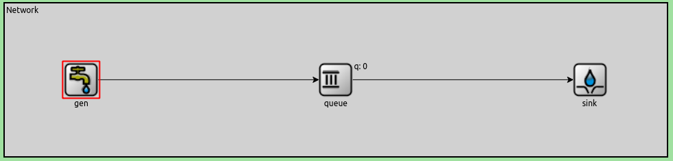

## Análisis de flujo y congestión en redes mediante simulación discreta con protocolos y mecanismos de feedback, aplicado a un sistema productor-consumidor en OMNeT++.
### Índice

- [Análisis de flujo y congestión en redes mediante simulación discreta con protocolos y mecanismos de feedback, aplicado a un sistema productor-consumidor en OMNeT++.](#análisis-de-flujo-y-congestión-en-redes-mediante-simulación-discreta-con-protocolos-y-mecanismos-de-feedback-aplicado-a-un-sistema-productor-consumidor-en-omnet)
  - [Índice](#índice)
- [*ABSTRACT*:](#abstract)
- [*INTRODUCCIÓN*:](#introducción)
- [*MÉTODOS*:](#métodos)
- [RESULTADOS:](#resultados)
  - [En la primera parte](#en-la-primera-parte)
  - [En la segunda parte:](#en-la-segunda-parte)
- [Útiles en general](#útiles-en-general)
- [Para el control de flujo](#para-el-control-de-flujo)
- [Para el control de congestión](#para-el-control-de-congestión)
- [IMPORTANTE: Suposiciones bajo las cuales sabemos nuestro protocolo funciona de manera decente](#importante-suposiciones-bajo-las-cuales-sabemos-nuestro-protocolo-funciona-de-manera-decente)
  - [Medida de 'carga ofrecida vs carga útil'](#medida-de-carga-ofrecida-vs-carga-útil)
- [DISCUSIÓN:](#discusión)
- [CONCLUSIÓN:](#conclusión)
- [ENLACE AL VIDEO DEL LAB3:](#enlace-al-video-del-lab3)
- [RAMAS PRINCIPALES:](#ramas-principales)
- [NOTA SOBRE BITBUCKET Y MARKDOWN:](#nota-sobre-bitbucket-y-markdown)
- [REFERENCIAS:](#referencias)
- [ANEXO:](#anexo)

## *ABSTRACT*:

&emsp;En este informe se detalla como se realizaron simulaciones de un sistema productor-consumidor con dos configuraciones de una red, la cual a causa de estas últimas, puede llegar a saturarse y ocasionar la pérdida de paquetes. 

&emsp;De esta forma, con la herramienta de OMNeT++ (que permite modelar y simular redes mediante eventos discretos) interpretaremos los datos que nos provee para crear nuestras propias conclusiones que nos ayuden a entender ciertos problemas que se experimentan en la capa de transporte.

## *INTRODUCCIÓN*:

&emsp;Utilizaremos esta parte del informe para poder presentar algunos conceptos que son importantes para entender el proyecto.

**¿Qué es una simulación discreta?:** La simulación discreta es una técnica donde los eventos ocurren en puntos discretos en el tiempo.
Cada evento es un suceso que provoca un cambio en el estado del sistema, estos se registran para su posterior estudio.

**Métricas a considerar:**

_Carga ofrecida:_ Es la cantidad de paquetes que se inyectan en la red por segundo. Se calcula contando la cantidad de paquetes que salen del buffer del nodo _nodeTx_ hacia la red, durante toda la simulación.

_Carga útil:_ Es la cantidad de paquetes que llegan al receptor por segundo. Se calcula contando la cantidad de paquetes que llegan al receptor durante toda la simulación.

_Retardo_: Es el tiempo que tardan los paquetes desde que salen del transmisor hasta que llegan al receptor. Tomaremos como medida el promedio de los retardos de cada paquete.

**¿Qué simulaciones haremos?:**

&emsp;Modificaremos el diseño de una red simple dos veces con dos modelos distintos (que se explican más adelante), y en cada una ejecutaremos dos casos distintos modificando las variables que sean necesarias. La red inicial es:

 

Red base 

## *MÉTODOS*:

&emsp;Dividiremos el trabajo en dos grandes segmentos que constan en cómo se modificó el diseño de la red, la primera parte es un diseño de red propuesto por la cátedra (que nos servirá como una introducción a la herramienta a usar). Posteriormente el segundo diseño de red debe ser alguna propuesta de nuestra parte que sea capaz de solucionar el problema de control de congestión, control de flujo o ambos, en el caso de nuestro grupo se fueron dando distintas respuestas hasta lograr una propuesta que intente mejorar el control de ambas situaciones.

&emsp;A su vez en ambos diseños se deben probar dos casos que son de interés:
 

* Caso 1 = Una red veloz que alimenta a un receptor de baja capacidad.

* Caso 2 = Una red lenta que alimenta a un receptor de alta capacidad.

## RESULTADOS:

### En la primera parte

&emsp;Se modificó la red de tal forma que exista un emisor con un buffer, un receptor con buffer y un buffer intermedio (que puede representar lo que en una red sería un router) el cual es suceptible a saturarse y empezar a descartar paquetes pues estos tienen un buffer de tamaño finito, y además se agregan tasas y delay de transmisión.Además se crearon los nodos:

  
**`NodeTx`:** Se compone del generador y una cola/queue. El generador se encarga d erepresentar la capa de aplicacion y genera paquetes cada cierta cantidad de tiempo. La cola/queue emula lo que sería la capa de transporte y manda los paquetes cuando se pueda y cuando no los almacena en un buffer hasta que nuevamente tenga la posibilidad de enviarlos.

**`NodeRx`:** Se compone de un consumidor y una cola/queue. El consumidor que representa la capa de aplicación se encarga de consumir los paquetes a una cierta velocidad fija. La cola/queue ,que nuevamente representa la capa de transporte, se encarga de recibir los paquetes y si puede lo manda al consumidor, sino empieza almacenarlos en un buffer hasta que el consumidor pueda nuevamente consumir más paquetes. Cabe aclarar que si el buffer intermedio se llena entonces empezará a `droppear` paquetes.

Entonces el diseño de red se verá finalmente de la siguiente forma:
 

Primer diseño de red 
</img>

1) **Caso 1**
 
    
&emsp;En este primer caso, observamos la presencia de un problema de control de flujo: si bien la infraestructura principal de la red (en nuestro caso la queue intermedia entre nodeTx y nodeRx) es capaz de mantener la transmisión de paquetes que el emisor (nodeTx) le envía al receptor (nodeRx) casi sin usar su almacenamiento, el problema yace en que el búffer interno de este último tiene una capacidad de "transferencia interna" (que puede ser vista como la velocidad del consumo de los datos) más baja que la del emisor y el resto de la red. Esto provoca que este búffer se llene, y se pierdan paquetes. 
     
    &emsp;Podemos ver que el comportamiento de el Delay de NodeRx se corresponde con el comportamiento que tienen las queue's NodeTx.queue y NodeRx.queue. A medida que se va haciendo uso de la primera, aumentan los delays (porque un paquete nuevo tendrá que esperar al resto antes de ser enviado). Luego de un tiempo de que comiencen las pérdidas de paquetes causadas por el problema de control de flujo (segundo 47 de la simulación aproximadamente), vemos perturbaciones en el mismo, causadas por las mismas (a partir del segundo 80 aproximadamente). Los paquetes que no se pierden, tendrán que esperar como máximo a que se envíen todo el resto de paquetes que acumuló NodeRx.queue, y por eso es que el delay parece estar acotado superiormente.
    

 

Uso de los búferes, perdidas de paquetes (solo hay en nodeRx.queue)  y delay (graficados con python) 

 

1) **Caso 2**
 
    &emsp;En esta ocasión, tenemos un problema similar al del caso anterior, pero en otro lugar. Tenemos un problema de congestión: aunque el emisor y el receptor serían capaces de mantener un flujo de datos continuo a sus máximas tasas de transferencia, la infraestructura de la red no, dado que la capacidad de transferencia de la cola intermediaria no es suficiente (la queue es la mitad de veloz que el resto de elementos de la red) por lo que el uso del búffer de la misma incrementa constantemente hasta que se llena, provocando la pérdida de paquetes.
     
    &emsp;Ahora, de manera similar al caso anterior, el comportamiento del delay se corresponde con el uso de dos queue's, en esta oportunidad la del emisor y la queue intermedia. Lo que sucede con el emisor es lo mismo que antes; a medida que acumula paquetes, aumenta el delay. Haciendo un análisis similar al anterior, esta vez ocurre que hay un datarate menor entre la queue intermedia y nodeRx, y esto hace que los paquetes se demoren en el búffer intermedio, de manera parecida a lo que ocurría en el caso anterior, pero el problema estará en la queue Network.queue.

 

Uso de los búferes, perdidas de paquetes (solo hay en nodeRx.queue)  y delay (graficados con python) 

### En la segunda parte:

&emsp;Inicialmente se modificó la red de tal forma que existan dos nuevas estructuras que influyan en la red:
TransportTx (Transmisor de Transporte):

**TransportTx:** Asociado al nodo emisor funciona como un medio de comunicación con el receptor; se encarga de tomar los datos de la capa de aplicación, encapsularlos en una estructura denominada `cPacket` y enviarlos por la red al destino.

**TransportRx:** Asociado al nodo receptor funciona como un medio de comunicación con el emisor; recibe los paquetes enviados por el transmisor los desencapsula y entrega a la capa de aplicación. Por otra parte gener una retroalimentación para el transmisor, enviando ACKs y otros datos más como feedback.

Posteriormente se pensó en algún algoritmo que fuera capaz de resolver los problemas planteados en la parte de _MÉTODOS_

**SOLUCION PROPUESTA:**

    
&emsp;Pensamos esta propuesta como una mejora de el algoritmo de `parada y espera`, de manera que en vez de enviar un paquete y esperar respuesta, se envían varios juntos en una *ráfaga*, y hasta que no haya una (única) contestación para todos esos paquetes, no se envía una próxima ráfaga.
    

A partir de esta idea base, le fuimos agregando al protocolo definido nuevas características, para tratar de apalear los problemas de control de flujo y congestión.

<h4>Invariantes que definimos para toda la transmisión:</h1>
<ol>
<li><b>El transmisor solo prepara la próxima ráfaga si recibió un ack del receptor.</b> Esto nos permite controlar variables tales como el tamaño de ventana desde el lado del receptor, haciendo sencillo el control de "cúantos paquetes se mandan" por ráfaga.
<li><b>Luego de una ráfaga, el receptor será capaz de determinar si hubieron pérdidas de paquetes o no.</b>
<li><b>El tamaño de ventana del transmisor (el tamaño de una ráfaga) es del mismo tamaño que el del receptor.</b> Esto es tan así, que el transmisor ni siquiera revisa que sea capaz de alojar la cantidad que el receptor le pide. <a href="#problema-winSize">Esto puede generar graves problemas</a></li>
<li><b>El tamaño de ventana del transmisor (el tamaño de una ráfaga) es menor o igual a la mitad del espacio restante en el transmisor.</b></li>
</ul>

  

Entre los mecanismos mediante los cuales garantizamos los invariantes, podemos separarlos según su principal utilidad:

## Útiles en general

1. Se clasifican los paquetes según su atributo *kind*. Definimos los distintos valores *DATA_KIND*, *FEEDBACK_KIND* y *BURSTENDED_KIND* como macros en el archivo "constants.h".
  
2. El receptor controla el tamaño de ventana del emisor usando los paquetes de feedback (que se corresponden a los que tienen el valor asociado a la macro *FEEDBACK_KIND* como atributo kind). También controla el atributo *parity*, que indica la paridad del número de ráfaga que se está enviando (explicado más adelante).

## Para el control de flujo

&emsp;A partir de la clasificación de los paquetes, es casi directo implementar la idea en función del concepto. Creamos múltiples eventos en omnet, tales como <b>prepareBurstEvent, sendPacketEvent, prepareFeedbackEvent, sendFeedbackEvent</b>, y los coordinamos mediante condicionales correspondientes en el emisor y en el receptor que, a partir de la información intercambiada por los feedbacks, determina cuándo y qué evento planificar.

 

&emsp;El receptor, controlará, como se verá en la próxima sección, el tamaño de ventana. Lo importante para el control de flujo, es que este será siempre una fracción entera del espacio disponible en el buffer del receptor, por lo que si este último se llena, no se enviarán paquetes de datos. Para simplificar la programación del protocolo, decidimos que el transmisor primero acumula los paquetes que va a enviar, y luego de tener todos, los envía. <a href="#problema-winSize">Esto tiene graves consecuencias</a>.

## Para el control de congestión

&emsp;Fue más difícil decidir qué haríamos para el control de congestión que para el control de flujo. 
Al final, decidimos seguir la siguiente idea, para determinar si un paquete se perdio por problemas en la red:

<ol>
    <li>Antes comenzar las transmisiones, el tamaño de ventana toma el valor de "espacioLibre/2", que se corresponde con la mitad del espacio disponible en el buffer del receptor.
    </li> 
    <li>Una vez que el transmisor completó una ráfaga, envía cada un intervalo de tiempo fijo un paquete de kind *BURSTENDED_KIND*, hasta que le llegue un feedback del receptor.
    </li> 
    <li>El receptor, dado que es quien controla el tamaño de ventana del emisor, sabe cuántos paquetes de tipo <b>DATA_KIND</b> deberían llegarle, y además tiene la garantía de que luego de la ráfaga, deberían únicamente llegarle paquetes de tipo <b>BURSTENDED_KIND</b>. A partir de esto, lo único que tiene que verificar es que, cuando recibe un paquete de este último tipo, ya le han llegado todos los paquetes que esperaba.
        <ul><li>Si al receptor <b>no le llegó</b> la cantidad de paquetes que esperaba, asume que fue por un problema de congestión, y reduce el tamaño de ventana (winSize) a <pre align="center">(winSize/3)+1</pre> 
        <li>Si al receptor <b>le llegaron</b> todos los paquetes que esperaba, le devuelve al transmisor un feedback de respuesta indicandole que debe usar un tamaño de ventana igual a:<pre align="center">(1-recoverySpeed) * min(winSizeAnterior, espacioLibre/2) + recoverySpeed * (espacioLibre/2)</pre></ul>
    </li>
</ol>
 

&emsp;Esto permite que, si el receptor no recibió suficientes paquetes, reduzca las transmisiones a un tercio de lo que eran (sin llegar a 0, por lo que le sumamos 1), y si luego todo sale bien, recupere una velocidad de transferencia razonable, haciendo un windowSize que se acerque a la mitad del espacio libre que tiene en el buffer lentamente. Observemos que si todo sale bien de entrada, "espacioLibre/2" será el tamaño de ventana.

 

##  IMPORTANTE: Suposiciones bajo las cuales sabemos nuestro protocolo funciona de manera decente

    &emsp;Sabemos que nuestro protocolo está lejos de ser perfecto. Más aún, hay situaciones que ni siquiera son consideradas, y podrían romper completamente el funcionamiento del mismo. Algunas de estas suposiciones son:
    <ol>
        <li>
            No hay pérdidas de paquetes por motivos que no sean la saturación de un buffer.
        </li>
        <li>
            El envío y la recepción de los paquetes es siempre en orden. Esto es, cuando ocurre una transmisión sin pérdidas,    <pre>si el transmisor envía los paquetes x1, x2, ... ,xn y el receptor recibe y1, y2, ... , yk con k <= n, entonces y1 = x1, y2 = x2, ... , yk = xk.</pre>
        </li>
    </ol>

 
&emsp;Entonces el diseño de red se verá finalmente de la siguiente forma:
 

 Diseño de red 

 

1) **Caso 1**

    &emsp;Ante el problema de control de flujo que observamos en la network original, ahora veremos que con nuestro protocolo suceden cosas distintas. Primero que nada, hacemos notar algo que aquí falta una gráfica, que es la de paquetes perdidos. Esto se debe a que para este primer caso, con los mecanismos que implementamos, no se produce ninguna pérdida de paquetes.

        

    &emsp;Comparando el delay de esta parte con el que se tenía sin usar el protocolo, vemos dos cosas interesantes a destacar:
    <ol>
        <li>
            No hay delays registrados hasta haber pasado aproximadamente 10 segundos. Esto se debe a la primera acumulación que tiene que hacer NodeTx antes de enviar paquetes. El primer paquete que llega a nodeRx, lo hace en esos tiempos.
        </li>
        <li>
            El delay es en general es un poco mayor que en el original, y llega a valores mucho más altos. Además, crece (a simple vista) linealmente con el tiempo, ya no fluctúa como en el modelo original hacía a causa de las pérdidas de paquetes.
        </li>
    </ol>
     
    &emsp;Este comportamiento es el esperado. Dado que el transmisor envía únicamente la cantidad de paquetes que el receptor le asigna a través del mecanismo de feedback, y este último siempre le asigna una cantidad inferior a la mitad del espacio que tiene libre en su buffer, nunca se envían paquetes que no se puedan recibir.
    &emsp;Si vemos de cerca la gráfica del espacio usado por la queue de NodeRx, vemos lo siguiente:

    

    &emsp;Esto no es ninguna sorpresa, por lo explicado anteriormente. Sumado a esto, vemos cómo se empieza a llenar deliberadamente el buffer de NodeTx, pues envía muchos menos paquetes. Esto es tan así, que su uso al final de la simulación supera más de 4 veces la capacidad total del buffer de NodeRx. Por otra parte, vemos que el uso de almacenamiento de QueueTowards y QueueBackwards es prácticamente nulo, algo esperable dado que las tasas de transmisión de sus conexiones son suficientemente altas para las exigencias de NodeRx y (sobretodo) NodeTx. 

1) **Caso 2**

&emsp;Analicemos el desempeño de nuestro algoritmo ante problemas de congestión:

&emsp;A simple vista algo que se puede notar es la sobredemanda que tiene NodeTx.transport, esto ocurre porque es quien debe esperar a que el generador produzca toda la ráfaga a enviar. Luego, debe enviar la misma a queueTowards y a su vez recibir los ACK`s de feedback, para cambiar el tamaño de la próxima ráfaga y enviarla. Contrariamente, ocurre que NodeRx.transport no se debe esforzar prácticamente, pues siempre la ráfaga que le llegará será del tamaño necesario para no saturar su capacidad. Además, las velocidades de transferencia le son favorables, pues su conexión con el sink tiene la misma tasa de transferencia que la conexión entre NodeTx.transport (no pasa lo mismo entre queueTowards y nodeRx.transport, que es el enlace que provoca la congestión).
    
&emsp;Por último hablando de las queue, ocurre que la Backward no tiene mucho paso de información pues solo debe pasar el feedback, pero la Toward debe pasar la ráfaga de paquetes de un transport a otro (recordando que además existe un paquete especial llamado BURSTENDED_KIND, que avisa del final de la ráfaga).
Por otro lado podemos observar que el delay no empeora ni mejora con respecto al "Caso 1",

### Medida de 'carga ofrecida vs carga útil'

    &emsp;Una de las medidas importantes que se pedian era el grafico de 'carga ofrecida vs carga útil', que nos permite analizar en un vistazo la capacidad que tiene el protocolo de controlar la perdida de carga que es inyectada a la red bajo las politicas que se aplican para tener control de flujo y control de congestion.

&emsp; Para construir estos graficos tomamos la cantidad (en promedio por segundo) de paquetes salientes de NodeTx, y la cantidad de paquetes recibidos (en promedio por segundo) por NodeRX. Esto mismo se realizo para 20 simulaciones donde el generation interval vario desde 1.0 hacia 0.05263157894736842. Esta toma de medidas se pueden probar, con el script de Python que esta en la branch 'cargautil'.

    &emsp; Veamos cómo fue la grafica en cada caso de los propuestos y analicemos los resultados que aparecen.

    

    

    &emsp; Notemos como en ambos casos de la parte uno, los graficos son practicamente el mismo, esto es porque al no haber control de congestion, y tener envios constantes al mismo ritmo, llega un punto donde las queues del medio estan constantemente saturadas por la incesante carga, haciendo que se pierda siempre casi todo. El limite de carga útil es el mismo ya que este solo variaria en función del tamaño de las queues que limitan con su capacidad maxima y el tiempo de la simulacion que habilita recibir un poco mas.

    

    

&emsp; En los casos de la parte 2 vemos se supera la proporción de carga ofrecida respecto a la de la parte 1 aldrededor del 5.0 de carga útil, ya que en casos razonables se puede controlar la congestion de forma exitosa, aunque no perfecta porque las queues intermedias (representantes de una red) suelen perder paquetes hasta que se regula la congestión. Hacia los casos finales, se sigue pudiendo controlar la congestión en menor medida, pero al final la curva se vuelve una función constante cerca del limite teorico. Principalmente porque el algoritmo esta pensado para perder y luego regular, pero las perdidas iniciales se van volviendo mas grandes que la carga ofrecida en un estado regulado.

## DISCUSIÓN:

Dado que nuestro protocolo debe suponer las <a href="#hipotesis">hipótesis que propuestas</a> para funcionar "correctamente", sabemos que:

<ol>
    <li>
        No garantiza confiabilidad en entrega de paquetes. Si el paquete "p" se pierde, no se vuelve a enviar el paquete "p", si no que se envía el próximo que haya agregado el generador a la queue.
    </li>
    <li >
        No garantiza orden en los paquetes de salida.
    </li>
    <li>
        Hay casos bordes que pueden romperlo. Por ejemplo, como el receptor es quien controla totalmente cuántos paquetes debe acumular el emisor antes de enviarlos, este último podría intentar guardar más paquetes de los que su capacidad le permite, provocando una pérdida constante de paquetes y, de hecho (a causa de nuestra implementación) un <b>deadlock</b> total en la transmisión;
    </li>
    <li>
        Si los tamaños de ráfaga son muy grandes, se desperdicia mucho tiempo y espacio acumulando paquetes que podría directamente ir enviando.
    </li>

</ol>

## CONCLUSIÓN:

    &emsp;Nuestro protocolo resuelve problemas de control de flujo de una manera decente y reduce las pérdidas de paquetes causadas por congestión, pero es bastante lento, requiere de muchas suposiciones para dar un útil funcionamiento, y carece de mecanismos que retransmitan paquetes perdidos y garanticen el orden deseado de los paquetes al consumidor.
     
    &emsp;Gracias por leer.

## ENLACE AL VIDEO DEL LAB3:
https://padlet.com/mebordone1/famaf-redes-2024-lab1-compart-tu-video-yptpug7c4wrftg9k/wish/2994821921

## RAMAS PRINCIPALES:

    &emsp;Las ramas importantes en el repositorio de este laboratorio (contienen sus respectivas versiones finales) son:
    <ul>
        <li>
            master | Rama principal (su código también contiene las implementaciones de la parte 2)
        </li>
        <li>
            parte1 | Implementaciones de la parte 1 (por defecto está configurado para correr la simulación con el caso 2)
        </li>
        <li>
            parte2 | Implementaciones de la parte 2 (por defecto está configurado para correr la simulación con el caso 2)
        </li>
    </ul>

## NOTA SOBRE BITBUCKET Y MARKDOWN:
&emsp;Hemos intentado que no suceda, pero parece ser que bitbucket tiene problemas para representar markdowns correctamente (en Visual Studio Code sabemos que se ve como debería), así que preferentemente conviene usar otro visualizador de markdown.

## REFERENCIAS:
https://es.wikipedia.org/wiki/Simulaci%C3%B3n_por_eventos_discretos

https://doc.omnetpp.org/omnetpp/manual/

https://stackoverflow.com/questions/36080576/when-to-use-send-senddirect-and-senddelayed-in-omnet

https://doc.omnetpp.org/omnetpp4/api/classcPacket.html

https://youtube.com/watch?v=W8r8zSPjeAs&feature=youtu.be

## ANEXO:

**¿Cómo utilizamos la inteligencia artificial en nuestro proyecto?**

    &emsp;Principalmente utilizamos la herramienta de copilot pues nos permitía ver más fácilmente ciertos errores que se nos pasaban y no nos dejaban compilar la simulación. Hemos hecho alguna que otra pregunta a chatGPT, pero inmediatamente estaba claro que "le mandaba fruta", pues las respuestas ni siquiera se correspondían con las ideas básicas de la pregunta. A veces era más difícil determinar la veracidad de sus afirmaciones que la fuerza bruto, y por ello era mucho más fiable testear, buscar en la documentación de omnet o (cuando habían preguntas bien respondidas) sacar información de <b>StackOverflow<b>.

