# Enrutamiento y gestión de una red por medio de simulaciones discretas en Omnet++

### Índice
1. [Abstract](#abstract*)
2. [Introducción](#introducción)
3. [Casos de estudio](#casos-de-estudio)
4. [Resultados](#resultados)
5. [Trazas de algoritmos](#Trazas-de-algoritmos)
6. [Discusión](#discusión)
7. [Referencias](#referencias)
8. [Anexo](#anexo)

## *ABSTRACT*:
<p align="justify">&emsp;En este informe se detalla el análisis de simulaciones en una red con topología de anillo, usando dos algoritmos (simplista y mejorado) de enrutamiento distintos para diferenciar el desempeño que producían en la red.
</p>
<p align="justify">&emsp;Para esto, usamos la herramienta OMNeT++ (que permite modelar y simular redes mediante eventos discretos). A partir de la herramienta podremos tomar distintas métricas que serán la prueba de la diferencia de desempeño entre los algoritmos de enrutamiento.
</p>

## *INTRODUCCIÓN*:
<p align="justify">&emsp;Utilizaremos esta parte del informe para detallar:
<ul>
    <li>
        Cómo es exactamente la topología de la red a la que sometemos a los algoritmos. 
    <li>
        Cómo son los casos en los que vamos a tomar las medidas (Como se comportan los nodos de la red)
    </li>
    <li> 
        Qué cosas asumimos para simular.
    </li>
</ul>
</p>

### **¿Qué es una topología de red?:**
<p align="justify">&emsp;La topología de red se define como la estructura de interconexión de nodos para el intercambio de datos. Existen dos tipos: Física y lógica. Mientras que la física se centra en la disposición física de dispositivos y conexiones, la lógica se enfoca exclusivamente en la configuración de las conexiones entre nodos, describiendo como pueden fluir los datos en la red (no se centra en las conexiones físicas existentes).</p>

### **¿Qué es una red en forma de anillo?:**
<p align="justify">&emsp;Una red en forma de anillo es un tipo de topología en la que cada nodo se conecta a exactamente otros dos, y hay una única componente conexa en el grafo que la representa. Los datos viajan de un nodo a otro, y cada nodo maneja cada paquete. Los anillos pueden ser unidireccionales (con sentido horario o antihorario) o bidireccionales. Pero los anillos unidireccionales pueden ser vulnerables pues si falla un solo enlace, nodo o rotura de cable, podría aislar los nodos conectados al anillo.</p>

&emsp;**Red inicial a trabajar:**
Cómo ya mencionamos la topología es una de anillo, donde en particular tenemos 8 nodos, y cada uno de ellos está conectado a otros dos nodos.

<p align="center">Topología de la red<br>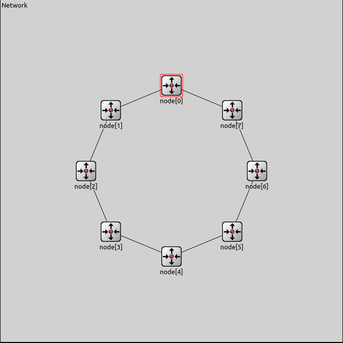</p>

&emsp;Internamente cada nodo cuenta con una representación de su capa de aplicación, que genera, recibe paquetes ("fusionada" con su capa de transporte) y se encarga de mandar asignar el nodo destino de los paquetes provenientes de la capa de aplicación. Contiene también una representación de una entidad de capa de red, que se encarga de decidir en qué dirección específica enviar paquetes que recibe que son enviados por sus vecinos o su aplicación, re-enviándolos a otro vecino o a su capa de aplicación según corresponda. Cada nodo posee a su vez dos entidades de capa de enlace, que representan las interfaces que permiten la transmisión efectiva de los datos entre nodos adyacentes (en el sentido usual).

<p align="center">Topología de la red<br>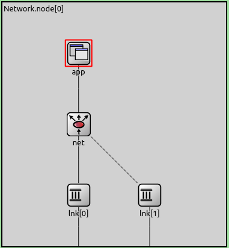</p>

#### **Algoritmo simplista (original del kickstarter):**
&emsp;Este algoritmo simplemente opera, estableciendo el recorrido de todos paquetes en sentido anti-horario, y si un paquete debe ser consumido por el nodo actual por el que está pasando, entonces lo envía a la capa de aplicación de allí mismo. Si no, lo envía al nodo siguiente en el anillo por la salida que no es la que uso para llegar.

#### **Algoritmo mejorado:**
&emsp;Este algoritmo utiliza paquetes especiales HELLO (que no son de datos de la capa de aplicación) para calcular la cantidad de saltos que se necesitan para llegar al destino y la cantidad de saltos que se necesitan para volver al nodo de origen.
Inicialmente, una vez que se decide el destino, se envía HELLO a través de alguna salida por defecto hacia la red. Este paquete se envía como los del algoritmo simplista, eventualmente llega al nodo destino, que escribe en el paquete la cantidad de saltos que le tomó llegar al destino (esto es un campo especifico del paquete), y lo envía de vuelta al nodo de origen; áca es importante mencionar que no lo envía por donde vino, sino que lo envía por la otra salida (recordemos en un topología de anillo solo hay dos salidas) de forma que al final el paquete siga contando saltos (en otro campo distinto) y tenga que recorrer el resto de la red (al final la ha recorrido completa). Cabe destacar que <a href="#TradeoffHello">no hay una fase dedicada al envío de paquetes especiales</a>, por lo que mientras se envían los HELLO van a fluir paquetes de datos en una dirección por defecto, hasta que cada nodo determine cuál es la que conlleva menor cantidad de saltos.

&emsp;El nodo origen recibe el paquete con la cantidad de saltos que tomaba llegar al destino y la cantidad de saltos que tomaba volver al nodo origen, con esta información determina que salida toma menos saltos.

&emsp;Si la cantidad de saltos al destino es menor o igual a la cantidad de saltos hasta el destino dividido por 2, entonces se envía el paquete de datos por la misma salida, si no se envía por la otra salida, ya que si tuvo que recorrer mas de la mitad de la red para llegar a destino por ese lado, significa que ir por la otra salida tomaba menos de la mitad.
Esto último se ve claramente observando el dibujo de la red, y es una de las principales ventajas de tener una topología de anillo.

##### **¿Que se busca con este algoritmo?:**
&emsp;Lo que se intenta obtener es una reducción de saltos por cada paquete, como efecto colateral bajamos el volumen de trafico global en la red i.e. Si hay varios nodos enviando a distintos destinos, de forma que si cada emisor esta a pocos saltos de su receptor, es menos probable que estos tengan que hacer circular trafico que no les corresponda.

&emsp;La reducción de saltos es la idea principal, pues para esto se hace el conteo de saltos desde cierto nodo a su destino y hacia sí mismo de nuevo. De esta forma intentamos crear una toma de decisión simple acerca de qué camino usar.

&emsp;Por otro lado la mitigación de los cuellos de botella lo podemos decir al compararlo con el algoritmo inicial; porque en vez de estar usando una misma ruta para todos los paquetes de una red, lo que ocurre es que los mismos se redistribuyen de cierta forma que resulta más "equitativa" (pues ciertos paquetes irán en una dirección y los otros en la dirección contraria).

#### **¿Cuales son las métricas?**
&emsp;Con el fin de poder evidenciar que el algoritmo que diseñamos es en efecto una mejora sobre el original. Vamos a tomar las siguientes métricas que nos permitirán comparar el desempeño de ambos algoritmos:
- _**Sent packets**_: Muestra los paquetes enviados momento a momento en la simulación. Sirve para tener una noción de la cantidad de tráfico que se suelta en la red.
- _**Delay**_: Muestra el tiempo que tarda un paquete en llegar al destino desde que se generó. Sirve para tener una noción de la eficiencia de la red. Para tomar esta medida se toma el tiempo de simulación en el que se consume el paquete y se le resta el tiempo en el que se generó.
- _**Seen packets**_: Se toma en cada nodo la cantidad de paquetes que circulan por el mismo en intervalos de un segundo. Sirve para tener una noción de la cantidad de tráfico que circula por cada nodo.


## Casos de estudio:
### _Caso 1_:
&emsp;Existen dos fuentes de tráfico ```node[9]``` y ```node[2]``` que continuamente envían paquetes a ```node[5]```.

### _Caso 2_:
&emsp;En este caso solo ```node[5]``` es a quien se le destina tráfico,y por el contrario todos los demás nodos serán fuentes de tráfico.

## RESULTADOS:
### Análisis obre el algoritmo simplista:
#### **CASO 1**:
##### Análisis de paquetes enviados:
&emsp;Para tener una noción de la frecuencia con que se generan paquetes y se ponen a circular en la red, medimos la cantidad de paquetes que se envían a lo largo de la simulación en cada momento.
Lo principal es notar que la cantidad de paquetes que se envían a la red es prácticamente constante.
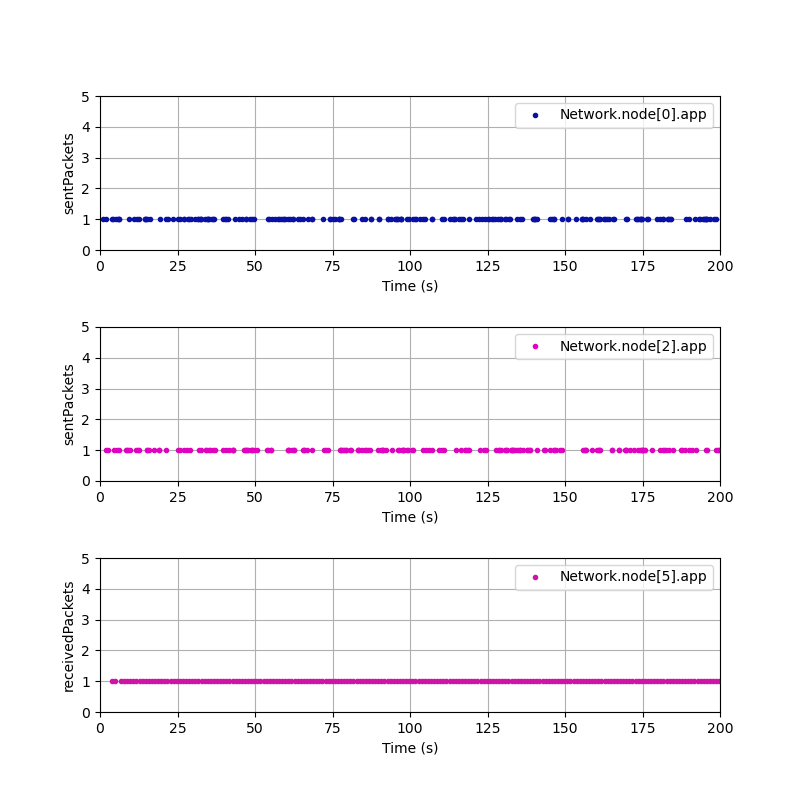

##### Análisis de delay:
&emsp;Otra métrica es la de _delay_, esta se toma en el nodo destino desde la interfaz de aplicación en ambos casos (1 y 2), al consumir un paquete de datos se toma la diferencia entre el tiempo de simulación y el tiempo en que se creo el paquete a consumir.
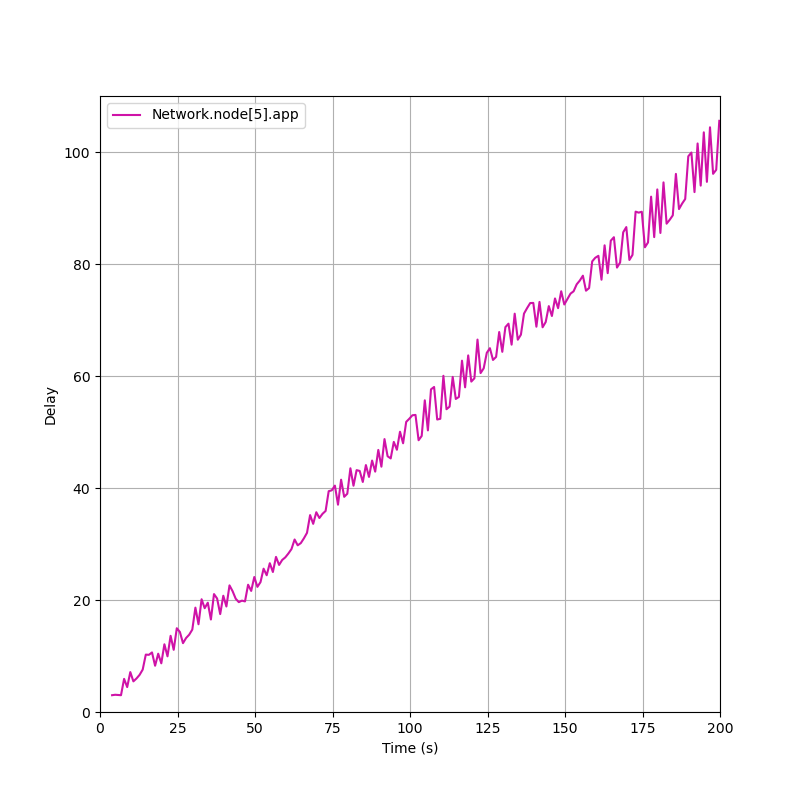
&emsp;Cómo podemos observar, de forma progresiva el _delay_ crece indicando que a medida que avanza la simulación, los paquetes generados tardan mas en llegar al destino. Esto puede ser a causa de que todos van a llegar al destino por el mismo 'lado', entonces se van acumulando y saturando el 'lado' de la red por el que se envían los paquetes.


##### Análisis de paquetes vistos:
&emsp;Por último, analizamos la cantidad de paquetes que circuló por un nodo en intervalos de un segundo.
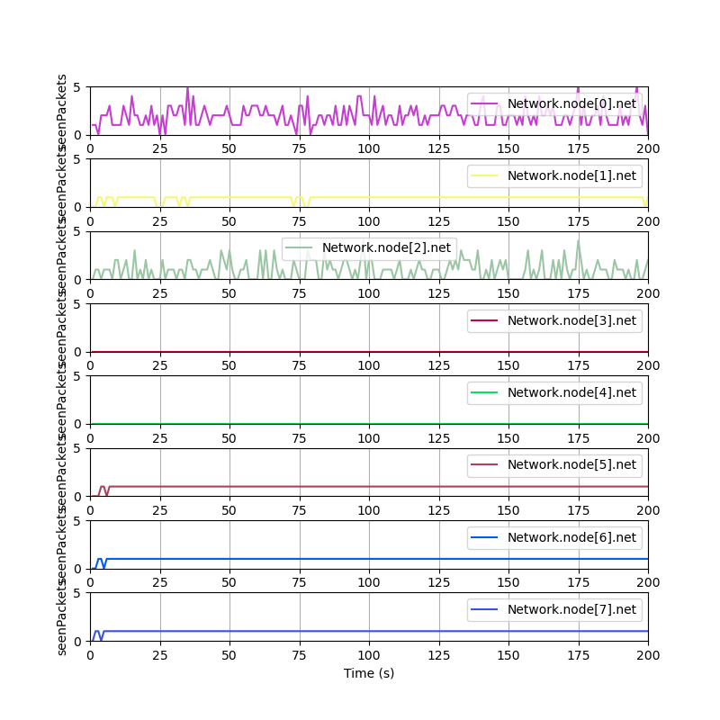

&emsp;Notemos que cómo el algoritmo simplista no tiene en cuenta otro camino que no sea recorrer la red en sentido anti-horario, los nodos que serían consecutivos (en sentido anti-horario) al nodo destino ni siquiera participan de la ruta, y no circulan paquetes a través de ellos.
También es destacable que los 'generadores' de tráfico (nodos 2 y 0) tienen gráficos mas irregulares ya que la cantidad de paquetes que ven tienen que ver mucho con los intervalos en que sus aplicaciones generan paquetes.

&emsp;Este gráfico también muestra que como ```node[0]``` es intermedio en la ruta de ```node[2]```, a diferencia de este último, el primero no suele tener 0's en la gráfica salvo en algunos puntos.

---
#### **CASO 2**

##### Análisis de paquetes enviados:
&emsp;Nuevamente presentamos los paquetes enviados a la red a lo largo de la simulación. En este caso tiene menos sentido que en el caso anterior, pues la mayoría de los nodos son fuentes de tráfico y la información no es tan relevante.
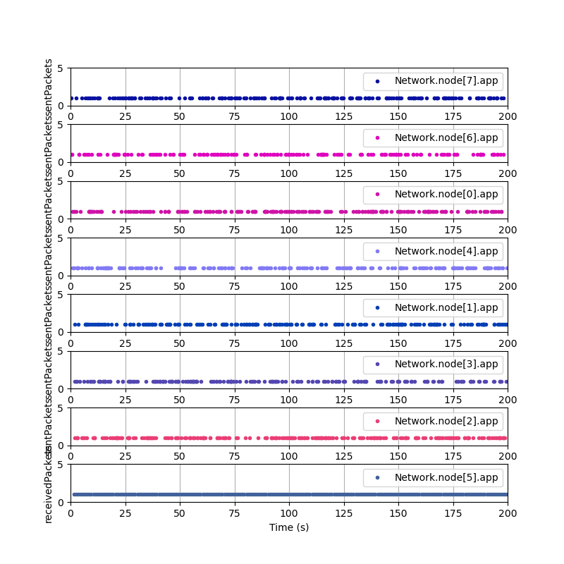

##### Análisis de delay:
&emsp;Lo que si es destacable es que ahora la métrica de _delay_ es mucho más caótica, creciendo mas rápido y de forma más irregular hacia el final de la simulación, esto es esperable debido al alto volumen de tráfico que al no regularse solo puede volverse peor. Se interpretan los gaps entre los picos como momentos donde llegaron varios paquetes generados muy cerca del destino. Por ejemplo al llegar un paquete de ```node[6]``` (el antecesor en sentido anti-horario) al destino se medirá que tardo muy poco, pero uno que salió desde ```node[4]``` difícilmente llegará en un tiempo comparable ya que tiene muchos saltos en medio y el tráfico saliente de los otros nodos interferirá en su ruta.


##### Análisis de paquetes vistos:
&emsp;Por último, la cantidad de paquetes que circuló por un nodo en intervalos de un segundo. Notemos que en este caso, al ser todos los nodos fuentes de tráfico, todos los nodos tienen un comportamiento similar, ya que se ven en general afectados por su propio intervalo de generación. La linea de ```node[5]``` se mantiene constante ya que su entrada de enlace procesa muy lentamente pero siempre tiene tráfico entrante por segundo.
Además de nuevo podemos ver que ```node[3]``` al no recibir tráfico saliente que no sea el propio, es el único que tiene 0's en la gráfica de forma usual.

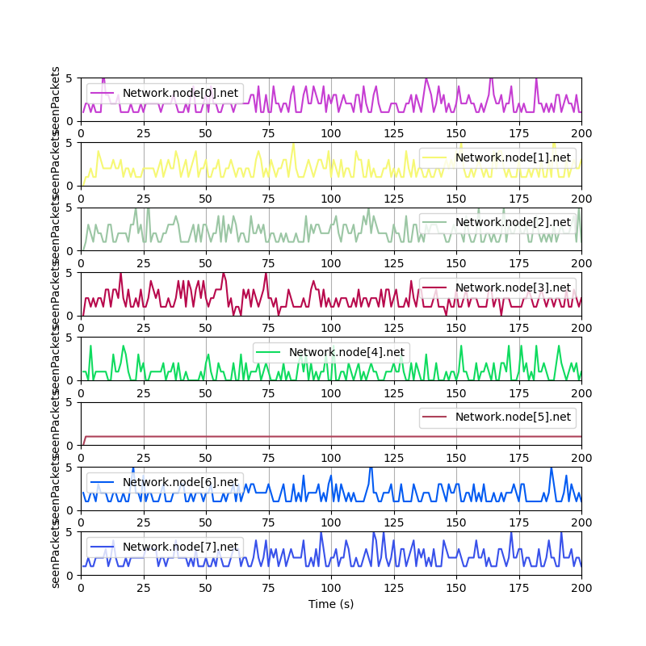
---
### Análisis sobre el algoritmo mejorado:
#### **CASO 1**:
##### Análisis de paquetes enviados:
&emsp;La gráfica trivialmente es exactamente la misma que en ambos casos anteriores, el tráfico que se suelta en la red no cambia porque este algoritmo no intenta controlarlo.

##### Análisis de delay:
&emsp;En este caso, el _delay_ es mucho más estable e incluso parece tener una cota superior bien definida en 20 segundos. Esto sucede porque en este caso en particular solo hay 2 emisores que están distribuyendo la carga uno en cada dirección, de forma que no se obstaculizan entre ellos.
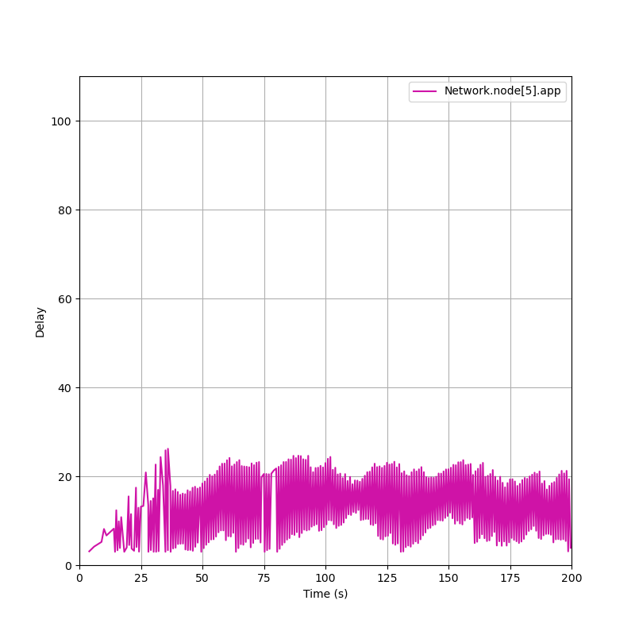

##### Análisis de paquetes vistos:
&emsp;Esta gráfica indica una leve mejora en la cantidad de paquetes que circulan por los nodos, veamos que al igual que en el caso 1 del algoritmo simplista, hay un nodo que no recibe tráfico luego de la etapa de hello, pero en este caso es ```node[1]``` y no ```node[3]```. Lo que es notable es que los nodos que generan tráfico ahora ambos llegan a tener 0's en la gráfica de forma regular, esto es principalmente porque ahora ```node[0]``` no es parte de la ruta del tráfico saliente del otro emisor (```node[2]```). Además veamos que los nodos no emisores que participan como intermediarios en la ruta de los emisores, no están recibiendo tráfico de forma constante, si no que hay segundos en los que no ven ningún tipo de tráfico.

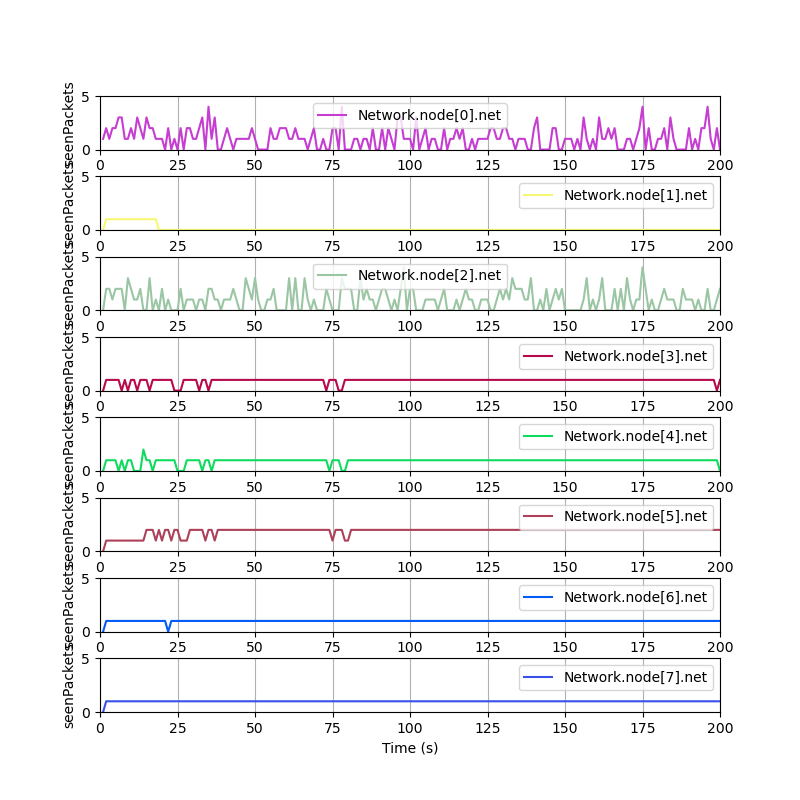
---

#### **CASO 2**:

##### Análisis de delay:
&emsp;En esta métrica tenemos un comportamiento muy interesante y poco esperado, comparemos el máximo de la gráfica con la del caso 1 del algoritmo simplista. En ambos casos máximo es un pico hacia el final de la simulación pero en el caso 2 del algoritmo mejorado es algo mas alto que en el simplista. Esto puede parecer raro pero es esperable, recordemos que la métrica de delay se toma una vez llegan los paquetes a destino, lo que realmente sucede es que como ahora los paquetes se distribuyen de forma más equitativa, los paquetes que parten desde nodos mas lejanos (en cantidad de saltos) al destino (como ```node[1]```) llegan a destino en un tiempo comparable a los que están simétricamente alejados (a la misma distancia en saltos) del destino. Esto repercute en el promedio del final que se usa para tomar el delay. Antes era mas usual que los paquetes que tenían orígenes cercanos (en saltos) llegaran antes que los que tenían orígenes lejanos, y hacia que fueran la mayoría de sumandos en el promedio.
Otro efecto que evidencia la mejora del algoritmo, es que ahora los valles de la gráfica son mas pronunciados, mostrando que también el mínimo de delay (visto en intervalos) es en general menor que en el caso 2 del algoritmo simplista.
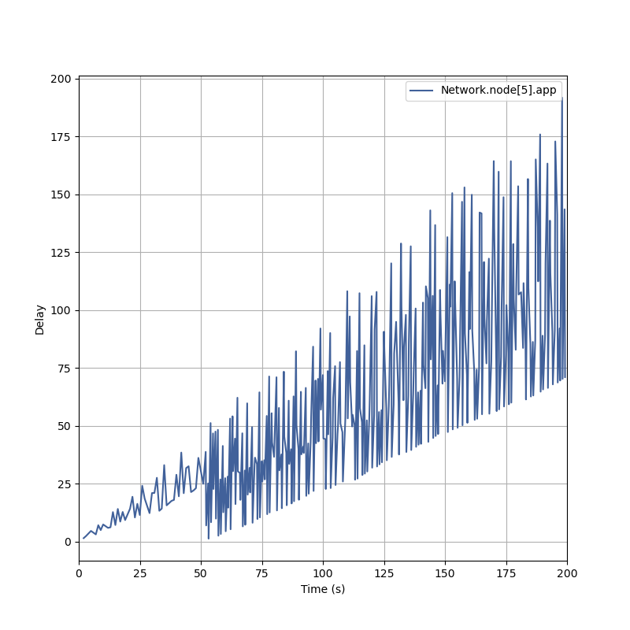


##### Análisis de paquetes vistos:
&emsp;Es difícil destacar algo significativo en este caso, pues la gráfica es muy similar a la del caso 1 del algoritmo mejorado, pero si podemos ver que el volumen de tráfico que avista el nodo destino es un poco mas, ya que ahora se distribuye e ingresa por ambas de sus salidas.


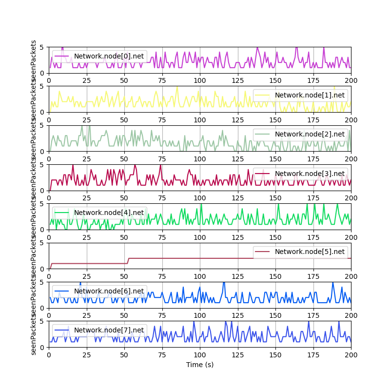


## DISCUSIÓN:
&emsp;Para este algoritmo estamos asumiendo que la topología de la red es en forma de anillo, así como también estamos asumiendo que la misma no va a cambiar con el paso del tiempo (no se van a sumar o caer nodos, no van a modificarse las conexiones de nodos dentro de la misma,etc). Por lo que algo interesante sería el pensar como generalizarlo a estos casos, ya que el algoritmo tal cual se encuentra pensado en este momento ante estas situaciones podría quedar obsoleto.

<p id="TradeoffHello"></p>
&emsp;<b>TradeOff con los paquetes HELLO:</b> Otra cosa a tener en cuenta es que hasta que lleguen todos los paquetes Hello y se calcule la mejor ruta los paquetes que se envían a la red siguen usando el esquema original, por lo que otra decisión de diseño podría ser crear una forma de que se genere una "Hello phase" en el que solamente circulen en la red los paquetes de este tipo, para que posteriormente ocurran los envíos de los demás paquetes haciendo que estos ya se encuentren direccionados a una ruta que sea eficiente. Esto tendría consecuencias distintas, en un comienzo se desperdiciaría un poco el uso de los enlaces y se llenarían un poco los distintos buffers, pero luego siempre se tendría una garantía directa de que el algoritmo distribuye los envíos de la manera más óptima (en cuanto a cantidad de saltos).

## **TRAZAS DE LOS ALGORITMOS**:
### Algoritmo simplista:

**Caso 1:** Los paquetes comienzan a enrutarse directamente al nodo de destino indicado. Generandose el cuello de botella antes descripto.


**Caso 2:** Los paquetes comienzan a enrutarse directamente al nodo de destino indicado. Generandose varios cuellos de botella de los que se han hablado. Y quedando la linea de `Nodo [5]` a `Nodo [4]` libre.

### Algoritmo modificado:

**Caso 1:** Comienza el periodo de reconocimiento de la red por medio de paquetes "Hello".


.png)

Luego en medio de la fase de reconocimiento se empiezan a mandar la data.
.png)

Finalmente se establecen los caminos más cortos para cada nodo, evitando en este caso el cuello de botella que se producía.

.png)

**Caso 2:** Comienza el periodo de reconocimiento de la red por medio de paquetes "Hello".

.png)

Luego en medio de la fase de reconocimiento se empiezan a mandar la data.

.png)

Finalmente se establecen los caminos más cortos para cada nodo, aunque de todas formas se producirán cuello de botellas por la demanda de la red (ya que casi todos los nodos producen y hay un único destino). Y quedando la linea de `Nodo [1]` a `Nodo [0]` libre.

.png)


## REFERENCIAS:
https://es.wikipedia.org/wiki/Topolog%C3%ADa_de_red

https://es.wikipedia.org/wiki/Red_en_anillo#:~:text=Una%20red%20en%20anillo%20es,cada%20nodo%20maneja%20cada%20paquete.

https://doc.omnetpp.org/omnetpp/api/classomnetpp_1_1cModule.html#a6273eb514331e0e44130844d637b8b4c

## ANEXO:
**¿Cómo utilizamos la inteligencia artificial en nuestro proyecto?**
Se le preguntó a Chat GPT sobre qué hacia la expresión `this->getParentModule()->getIndex()`, la respuesta fue larga y con un ejemplo de por medio pero el resumen fue:

&emsp;En resumen, this->getParentModule()->getIndex() es una herramienta útil en OMNeT++ para trabajar con la jerarquía de módulos y obtener información sobre la posición de un módulo dentro de su entorno de simulación.

&emsp;Anteriormente habíamos leído la información que provenía de una página oficial de Omnetpp (la cual está incluida en las referencias) que tiene información sobre las funciones de los objetos que se pueden usar, pero decidimos preguntarle para aclarar más las ideas y tener un ejemplo más pequeño que nos abstrajera del proyecto para comprender con más claridad.